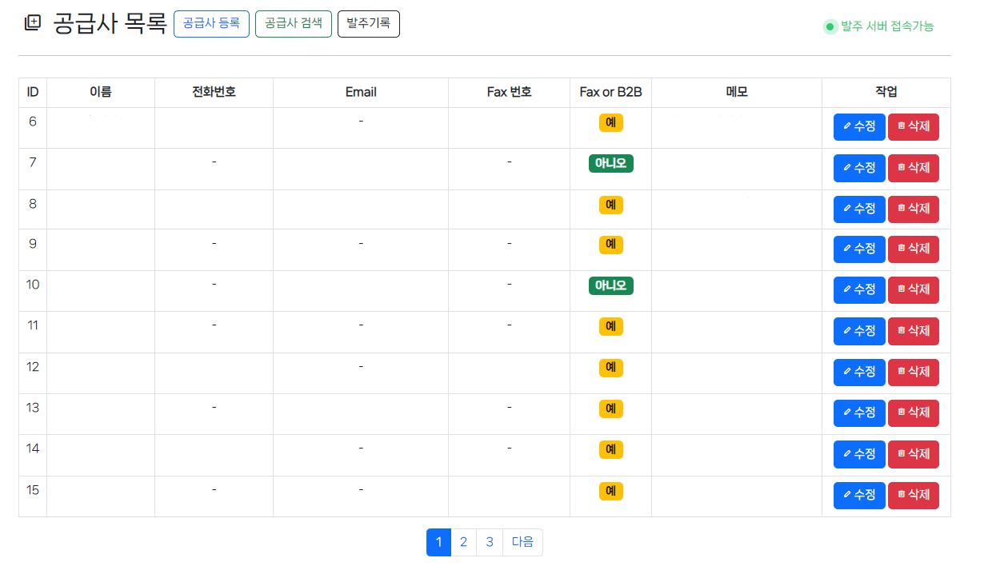
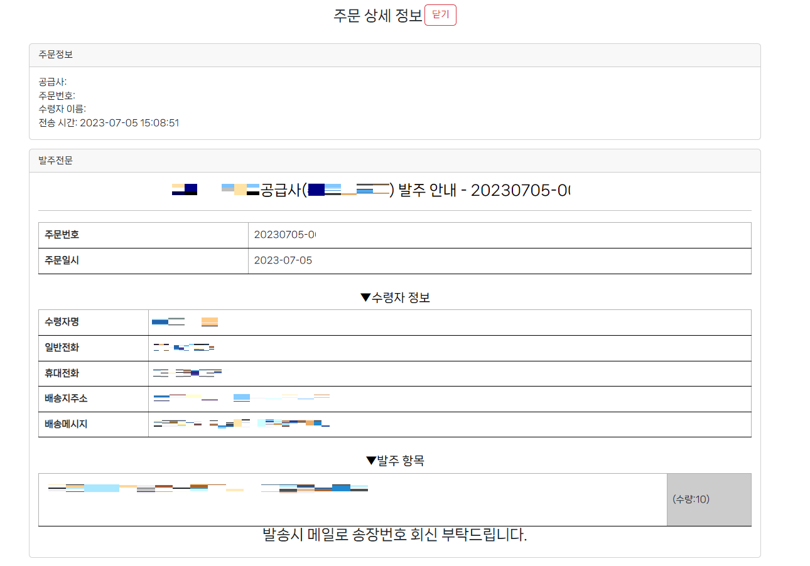

# Cafe24 SimpleERP Script
Cafe24에서 발생된 주문 건을 자동으로 공급처에 전송하는 프로그램을 관리하는 Front 스크립트입니다.
## Features

- 주문 내용을 json으로 구조화

## Screenshots

  

## Note
1. WEB 관리페이지는 [Cafe24-SimpleERP-WEB](https://github.com/bsy0317/Cafe24-SimpleERP-WEB) 저장소를 확인하시기 바랍니다.
2. 회사와의 계약조건에따라 가장 중요한 Backend Code는제공하지 않습니다.
## Support

For support, email talk@kakao.one

